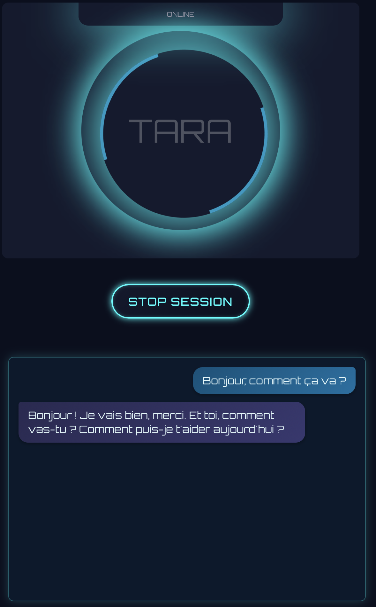

# Tara: Real-time Local Voice Assistant with Barge-in

[](https://opensource.org/licenses/MIT)

**Author:** Christophe Verdier  
**Contact:** christophe.verdier@sponge-theory.ai  
**Website:** [https://sponge-theory.ai](https://sponge-theory.ai)

Tara is a sophisticated, real-time, French-first voice assistant designed for seamless and natural interaction. It prioritizes local processing for enhanced privacy and offline capabilities, featuring a modern web front-end and intelligent barge-in functionality.



## Core Features

*   **Real-time Voice Interaction**: Experience low-latency, two-way spoken conversations.
*   **Local-First Processing**: Prioritizes on-device VAD (Silero), STT (faster-whisper), and TTS (Piper), promoting privacy and enabling offline functionality. LLM can be configured to run locally or remotely.
*   **Intelligent Barge-in**: Allows users to interrupt the assistant naturally during its speech, creating a more fluid conversational experience.
*   **Sentence-by-Sentence TTS**: Delivers audio feedback more immediately and naturally as the assistant formulates its response.
*   **Futuristic & Reactive UI**: A modern web interface built with React, featuring:
    *   Dynamic audio-reactive animations (reacting to both microphone input and TTS playback).
    *   A clear, scrollable chat display for conversation history (user transcriptions and assistant responses).
*   **Modular Microservice Architecture**: Built with Python and FastAPI, services include:
    *   **API Gateway**: Manages WebSocket connections, client communication, and routes messages.
    *   **VAD/STT Worker**: Performs voice activity detection and speech-to-text.
    *   **LLM Orchestrator**: Manages conversation flow, LLM interaction, and tool execution.
    *   **TTS Service**: Synthesizes speech from text.
    All backend services communicate efficiently via Redis pub/sub for scalability and maintainability.
*   **Tool Usage**: The LLM is capable of using predefined tools to interact with external systems or perform specific actions.
*   **Configurable**: Easily customize voice, STT models, LLM provider/model, and other parameters through `.env` files.

## Technology Stack

**Frontend:**
*   React, TypeScript
*   Zustand (State Management)
*   SVG / Three.js (for reactive animations - current version uses SVG)
*   WebSockets

**Backend:**
*   Python 3.12+
*   FastAPI (API Gateway & Microservices)
*   Redis (Message Broker, Caching)

**Audio Processing:**
*   Voice Activity Detection (VAD): Silero VAD
*   Speech-to-Text (STT): faster-whisper
*   Text-to-Speech (TTS): Piper TTS

**Language Model (LLM):**
*   Configurable: Supports OpenAI models by default, adaptable for other providers or local models (e.g., via Ollama, LM Studio).

**Package Management & Workflow:**
*   UV (Python package installer, resolver, and virtual environment manager)

## Project Structure

The project is organized into a frontend application and several backend microservices:

*   **`frontend/`**: Contains the React-based web interface for user interaction.
*   **`app/`**: The main FastAPI Gateway. Handles WebSocket connections, authentication (JWT), and routes messages between the client and other backend services via Redis.
*   **`vad_stt_worker/`**: VAD and STT worker. Consumes raw audio, performs VAD with Silero, and STT with faster-whisper.
*   **`llm_orchestrator_worker/`**: LLM Orchestrator. Manages conversation state, interacts with the chosen Language Model, handles tool calls, and requests TTS generation.
*   **`tts_worker/`**: Text-to-Speech (TTS) worker. Synthesizes speech from text using Piper TTS.

Each backend service operates independently and communicates via Redis pub/sub channels.

## Prerequisites

*   Python 3.12+
*   [UV](https://github.com/astral-sh/uv) (Python package manager, install with `pip install uv`)
*   A running Redis server.
*   **For TTS Service (`tts_worker`)**:
    *   Piper TTS executable.
    *   Piper voice models.
    *   Download these and configure their paths in `tts_worker/.env`.
*   **For VAD/STT Worker (`vad_stt_worker`)**:
    *   STT models for faster-whisper will be downloaded on the first run if not already cached in the default Hugging Face cache location.
*   **(Optional) LLM API Key**: If using a remote LLM provider like OpenAI, you'll need an API key.

## Setup and Configuration

1.  **Clone the Repository:**
    ```bash
    git clone <repository_url> # Replace with your repository URL
    cd tara-voice-assistant # Or your repository name
    ```

2.  **Environment Configuration:**
    Each backend service (`app`, `vad_stt_worker`, `llm_orchestrator_worker`, `tts_worker`) requires its own `.env` file located in its respective directory. These files are used for service-specific settings. Create them by copying the corresponding `.env.example` files (if provided) or by creating them from scratch based on the examples below.

    **Key variables to configure:**

    *   **Common for all workers (`vad_stt_worker/`, `llm_orchestrator_worker/`, `tts_worker/`)**:
        ```env
        # .env in each worker directory
        REDIS_HOST=localhost
        REDIS_PORT=6379
        # REDIS_PASSWORD=your_redis_password (if applicable)
        # REDIS_DB=0
        LOG_LEVEL=INFO
        ```

    *   **`app/.env` (FastAPI Gateway)**:
        ```env
        PROJECT_NAME="Tara Voice Assistant - Gateway"
        REDIS_HOST=localhost
        REDIS_PORT=6379
        JWT_SECRET_KEY="!!!CHANGE-THIS-TO-A-STRONG-RANDOM-SECRET-KEY!!!" # CRITICAL for security
        # JWT_ALGORITHM="HS256" (default)
        # JWT_ACCESS_TOKEN_EXPIRE_MINUTES=1440 (default is 24 hours)
        ```

    *   **`vad_stt_worker/.env` (additional settings)**:
        ```env
        # VAD Settings (defaults are in config.py, override here if needed)
        # VAD_MODEL_REPO="snakers4/silero-vad"
        # VAD_MODEL_NAME="silero_vad"
        # VAD_SAMPLING_RATE=16000 # Ensure this matches your mic input and STT model expectations
        # VAD_THRESHOLD=0.5 # Sensitivity of voice detection

        # STT Settings
        STT_MODEL_NAME="Systran/faster-whisper-large-v3" # Example: "openai/whisper-base", "Systran/faster-whisper-large-v3-french"
        STT_DEVICE="cpu" # Or "cuda" if you have a compatible NVIDIA GPU and CUDA installed
        STT_COMPUTE_TYPE="int8" # e.g., "float16", "int8" (int8 is faster on CPU, float16 for GPU often good)
        # STT_LANGUAGE="fr" # Set if you want to force a specific language for STT
        ```

    *   **`llm_orchestrator_worker/.env` (additional settings)**:
        ```env
        LLM_PROVIDER="openai" # Example: "openai", "ollama", "custom_openai_compatible"
        LLM_MODEL_NAME="gpt-3.5-turbo" # Example: "gpt-4", "llama3", "mistral"
        LLM_API_KEY="sk-YOUR_OPENAI_API_KEY" # Replace with your actual LLM API key if using OpenAI or similar
        # LLM_BASE_URL="http://localhost:11434/v1" # Example for local Ollama OpenAI-compatible endpoint
        # DEFAULT_TTS_VOICE_ID="fr_FR-siwis-medium.onnx" # Default voice ID for TTS requests if not specified elsewhere
        SYSTEM_PROMPT="You are Tara, a helpful and concise voice assistant. Respond in French unless the user speaks in another language."
        ```

    *   **`tts_worker/.env` (additional settings)**:
        ```env
        PIPER_EXECUTABLE_PATH="/path/to/your/piper/executable" # IMPORTANT: Absolute path to the Piper executable
        PIPER_VOICES_DIR="/path/to/your/piper_voices/"        # IMPORTANT: Absolute path to the directory containing Piper voice model files (.onnx and .json)
        # DEFAULT_PIPER_VOICE_MODEL="fr_FR-siwis-medium.onnx" # Default voice model file name (must be in PIPER_VOICES_DIR)
        # PIPER_VOICE_NATIVE_SAMPLE_RATE=22050 # Sample rate of your Piper voice model (check model's .json config)
        # AUDIO_OUTPUT_SAMPLE_RATE=24000 # Target output sample rate for client (resampling will occur if different)
        ```

3.  **Install Dependencies for Each Service:**
    Navigate into each service's directory (`app`, `vad_stt_worker`, `llm_orchestrator_worker`, `tts_worker`) and the `frontend` directory. Install dependencies using UV for Python services and npm/yarn/pnpm for the frontend.

    **Backend Services (Python):**
    ```bash
    # Example for the API Gateway
    cd app
    uv sync
    cd ..

    # Repeat for vad_stt_worker, llm_orchestrator_worker, tts_worker
    cd vad_stt_worker
    uv sync
    cd ..
    # ... and so on
    ```

    **Frontend (React):**
    ```bash
    cd frontend
    npm install # or yarn install or pnpm install
    cd ..
    ```
    Ensure your `pyproject.toml` files in each Python service directory correctly list their dependencies.

## Running the Services

Helper scripts are provided in the root directory for managing backend services:

-   `run.sh`: Starts all backend services in the background. Logs for each service are stored in a `logs/` directory (created in the project root).
-   `kill_all.sh`: Attempts to stop all backend services started by `run.sh`.

1.  **Make scripts executable (if not already):**
    ```bash
    chmod +x run.sh
    chmod +x kill_all.sh
    ```

2.  **Start all backend services:**
    ```bash
    ./run.sh
    ```
    This will launch the FastAPI Gateway, VAD/STT Worker, LLM Orchestrator, and TTS Service. Check the `logs/` directory for output from each service.

3.  **Start the Frontend Development Server:**
    ```bash
    cd frontend
    npm run dev # or yarn dev or pnpm dev
    cd ..
    ```
    The frontend will typically be available at `http://localhost:5173` (Vite default) or as specified in your frontend setup.

4.  **Accessing the API (Gateway):**
    The FastAPI gateway (backend) will typically be available at `http://localhost:8000` (as configured in `app/pyproject.toml` or your `uv run` command).
    *   API Docs (Swagger UI): `http://localhost:8000/docs`
    *   Health Check: `http://localhost:8000/v1/health`
    *   WebSocket Endpoint: `ws://localhost:8000/v1/ws/audio`

5.  **WebSocket Authentication (JWT):**
    The WebSocket endpoint `/v1/ws/audio` is protected by JWT. The client (frontend) must provide a valid JWT token as a query parameter named `token`.
    Example: `ws://localhost:8000/v1/ws/audio?token=<your_jwt_token>`
    For development, you might need a utility or a temporary unsecured endpoint in the `app` service to generate a token. The `JWT_SECRET_KEY` in `app/.env` is used for this.

## Stopping the Services

*   **Backend:**
    ```bash
    ./kill_all.sh
    ```
    Verify manually if all processes were stopped (e.g., using `ps aux | grep python` or `ps aux | grep uvicorn`).
*   **Frontend:** Stop the development server using `Ctrl+C` in its terminal.

## Development

*   **UV Package Manager**: This project uses UV for Python dependency management and running scripts. Refer to UV documentation for more commands (`uv pip compile`, `uv venv`, etc.).
*   **Individual Service Development**: You can run backend services individually. Navigate to their directory and use `uv run dev` (or the specific script defined in their `pyproject.toml`, e.g., `uvicorn app.main:app --reload --port 8000`).
*   **Linting and Formatting**: Python code quality is maintained using Ruff (for linting and formatting) and MyPy (for type checking). It's recommended to integrate these into your development workflow.
    ```bash
    # Example: Run Ruff from a service directory or project root if configured
    uv run lint
    uv run format
    ```
*   **Frontend Development**: Standard React/TypeScript development practices apply.

## Author & Contact

*   **Christophe Verdier**
*   **Email**: christophe.verdier@sponge-theory.ai
*   **Website**: [https://sponge-theory.ai](https://sponge-theory.ai)

Contributions are welcome! Please feel free to submit issues or pull requests.

## License

This project is licensed under the MIT License. See the [LICENSE](LICENSE) file for details.

```
app/
├── api/
│   ├── deps.py
│   └── v1/
│       ├── __init__.py
│       └── endpoints/
│           ├── __init__.py
│           └── audio.py
├── core/
│   ├── __init__.py
│   ├── auth.py
│   ├── config.py
│   ├── logging_config.py
│   └── security.py
├── db/
│   ├── __init__.py
│   ├── base.py
│   ├── base_class.py
│   └── session.py
├── main.py
├── middleware/
│   ├── __init__.py
│   ├── cors.py
│   ├── db_health.py
│   ├── error_handler.py
│   ├── logging.py
│   └── validation.py
├── models/
│   └── __init__.py
├── schemas/
│   ├── __init__.py
│   └── ws_messages.py
├── services/
│   └── __init__.py
├── tasks/
└── utils/
pyproject.toml
README.md
# .env (you create this)
# .env.example (you create this)
```

